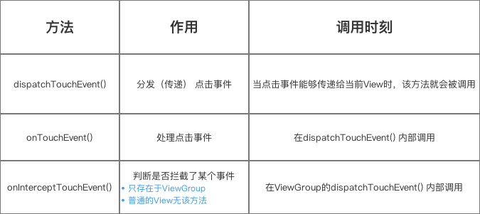

# Android、Java 面试集锦

## 一、Android 面试
### 1. Intent 传值有大小限制吗，为什么，如何处理；
#### 1.1 限制：
Intent（包括Bundle一共）大小限制为不到 1MB(实测某些机型上 500k 左右也无法正常传递)，所以在超过这个限制之后，就会出现静默崩溃的现象

#### 1.2 解决方案：

* 写入临时文件或者数据库，通过 FileProvider 将该文件或者数据库通过 Uri 发送至目标。一般适用于不同进程，比如分离进程的 UI 和后台服务，或不同的 App 之间。之所以采用 FileProvider 是因为 7.0 以后，对分享本 App 文件存在着严格的权限检查。
* 通过设置静态类中的静态变量进行数据交换。一般适用于同一进程内，这样本质上数据在内存中只存在一份，通过静态类进行传递。需要注意的是进行数据校对，以防多线程Data Racer出现导致的数据显示混乱。

### 2. 自定义 View 流程，主要的方法及各自作用；如何防止过度绘制；对 View 中的 onMesurse 方法的详细介绍和使用
屏幕坐标图解：


#### 2.1 View 的绘制流程:
整个 View 树的绘制流程在 ViewRoot 类的 performTraversals() 函数展开，绘制函数的调用  


View 主要包括有三个过程:  


##### 1) Measure：测量 View 的大小，measure 方法是 final 的，无法重写，measure 过程
View 绘制从 ViewRoot 的 performTraversals() 方法中开始。首先调用的是 performMeasure() 方法，它会调用 View 的 measure 方法进行测量，
而 DecorView (继承 FrameLayout)的父类是 ViewGroup，ViewGroup 又是继承于 View 的，具体的测量流程如图所示；


View 绘制主要分为两种情况，View 和 ViewGroup：

* View 通过 measure() 方法完成测量过程，获取View最终的大小是在 onMeasure 方法中，如果要想自定义 View，可以复写该方法
* ViewGroup 会循环遍历子 View，所有的子 View 测量完成才算结束；ViewGroup 中没有具体 onMeasure 方法，因为不同的 ViewGroup 子类有不同的布局特性，没有统一的 onMeasure 进行测量
不过它提供了 measureChildren 和 measureChildWithMargins 方法来测量子视图的大小。DecorView 继承的 FrameLayout，复写了 onMeasure 方法，通过 measureChildWithMargins 方法测量所有子视图。
从View和ViewGroup视图测量的流程看出，有几个核心方法:

* mearsure: 定义在 View 中，为 final 类型，不可被复写，但 measure 调用链最终会回调 View/ViewGroup 对象的 onMeasure() 方法，因此自定义视图时，只需要复写 onMeasure() 方法即可。
* onMeasure: 自定义视图中需要实现的方法，该方法的参数是父视图对子视图的 width 和 height 的测量要求。根据 widthMeasureSpec 和 heightMeasureSpec 计算视图的 width 和 height，不同的模式处理方式不同。
* setMeasuredDimension: 测量阶段终极方法，在 onMeasure(int widthMeasureSpec, int heightMeasureSpec) 方法中被调用，将计算得到的尺寸，传递给该方法，测量阶段即结束。

##### 2) Layout：对 View 进行布局，确定 View 的位置
layout 的作用是 ViewGroup 用来确定子视图的位置，当 ViewGroup 的位置被确定后，它会在 onLayout 中遍历所有的子视图并调用其 layout 方法，在 layout 方法中，onLayout 方法又会被调用。


* setFrame 方法确定 View 的四个顶点位置，即确定了 View 在父容器中的位置;
* View 和 ViewGroup 均没有真正实现 onLayout 方法;


3) Draw：对 View 进行绘制，显示内容，根据官方文档，其步骤如下：

* Draw the background
* If necessary, save the canvas’ layers to prepare for fading
* Draw view’s content
* Draw children
* If necessary, draw the fading edges and restore layers
* Draw decorations (scrollbars for instance)


ViewGroup 的 dispatchDraw 方法会遍历所有子 View 的 draw 方法。

#### 2.2 自定义 View 主要分为三类:

* 自绘控件，继承View，通过onDraw方法绘制。
* 组合控件，使用系统已有的控件，把进行布局和绘制。
* 继承控件，继承现有的控件，去实现一些新的功能。


#### 2.3 过度绘制：
#### 1）什么是过度绘制（OverDraw）
在多层次重叠的 UI 结构里面，如果不可见的 UI 也在做绘制的操作，会导致某些像素区域被绘制了多次。这样就会浪费大量的 CP U以及 GPU 资源。过度绘制最直观的影响就是会导致APP卡顿。还好系统有提供 GPU 过度绘制调试工具会在屏幕上用不同的颜色，来表明一个像素点位被重复绘制的次数。

#### 2）屏幕上不同的颜色代表着什么？

* 原色 – 没有被过度绘制 – 这部分的像素点只在屏幕上绘制了一次
* 蓝色 – 1 次过度绘制– 这部分的像素点只在屏幕上绘制了两次
* 绿色 – 2 次过度绘制 – 这部分的像素点只在屏幕上绘制了三次
* 粉色 – 3 次过度绘制 – 这部分的像素点只在屏幕上绘制了四次
* 红色 – 4 次过度绘制 – 这部分的像素点只在屏幕上绘制了五次

#### 3）怎么解决应用过度绘制？

控制界面最多被过度绘制 2 次（不出现粉色和红色）

* 移除默认的 Window 背景： 一般应用默认继承的主题都会有一个默认的 windowBackground ，比如默认的 Light 主题，但是一般界面都会自己设置界面的背景颜色或者列表页则由 item 的背景来决定，所以默认的 Window 背景基本用不上，如果不移除就会导致所有界面都多 1 次绘制
* 移除不必要的背景：ViewPager 加多个 Fragment 组成的首页界面，如果你的每个 Fragment 都设置有背景色的话， 你就可以不用给 Activity 的根布局设置背景，如果你还给 ViewPager 还设置了背景，那个这个背景是没必要的，同样可以移除。
* 合理且高效的布局：使用 RecyclerView 的 addItemDecoration(ItemDecoration decor) 方法添加分割线
* 自定义控件使用 clipRect() 和 quickReject() 优化：当某些控件不可见时，如果还继续绘制更新该控件，就会导致过度绘制。但是通过 Canvas clipRect() 方法可以设置需要绘制的区域，当某个控件或者 View 的部分区域不可见时，就可以减少过度绘制
* 尽量多使用 RelativeLayout 和 LinearLayout, 不要使用绝对布局 AbsoluteLayout
* 在布局层次一样的情况下， 建议使用 LinearLayout 代替 RelativeLayout, 因为 LinearLayout 性能要稍高一点，将可复用的组件抽取出来并通过include标签使用
* 使用 ViewStub 标签来加载一些不常用的布局；动态地 inflation view 性能要比 SetVisiblity 性能要好.当然用 VIewStub 是最好的选择
* 使用 merge 标签减少布局的嵌套层次
* 使得Layout宽而浅，而不是窄而深（在Hierarchy Viewer的Tree视图里面体现）

参考：
https://blog.csdn.net/carson_ho/article/details/56009827

### 3. 事件分发及举例说明

#### 3.1 事件分发的基础知识：

##### a. 事件分发的对象是谁？点击事件（Touch 事件）
当用户触摸屏幕时（View 或 ViewGroup 派生的控件），将产生点击事件（Touch事件），Touch事件的相关细节（发生触摸的位置、时间等）被封装成 MotionEvent 对象

事件类型：

* MotionEvent.ACTION_DOWN： 按下View（所有事件的开始）
* MotionEvent.ACTION_UP：抬起 View（与 DOWN 对应）
* MotionEvent.ACTION_MOVE：滑动 View
* MotionEvent.ACTION_CANCEL： 结束事件（非人为原因）

事件序列（从手指接触屏幕 至 手指离开屏幕，这个过程产生的一系列事件），即当一个点击事件（MotionEvent ）产生后，系统需把这个事件传递给一个具体的 View 去处理。


##### b. 事件分发的本质
将点击事件（MotionEvent）传递到某个具体的View & 处理的整个过程，即事件传递的过程 = 分发过程

##### c. 事件在哪些对象之间进行传递？

Activity、ViewGroup、View: Android 的 UI 界面由Activity、ViewGroup、View 及其派生类组成


##### d. 事件分发的顺序

即 事件传递的顺序：Activity -> ViewGroup -> View
即：1个点击事件发生后，事件先传到 Activity、再传到ViewGroup、最终再传到 View

##### e. 事件分发过程由哪些方法协作完成？

dispatchTouchEvent() 、onInterceptTouchEvent()和onTouchEvent()




#### 3.2 Activity 的事件分发机制

当一个点击事件发生时，从Activity的事件分发开始（Activity.dispatchTouchEvent()）


#### 3.3 ViewGroup 事件的分发机制

Android 事件分发总是先传递到 ViewGroup、再传递到 View


#### 3.4  View 事件的分发机制

View 事件分发机制从 dispatchTouchEvent() 开始


#### 3.5 总结：


参考：https://blog.csdn.net/carson_ho/article/details/54136311

### 4. LruCache 和 DiskLruCache 的原理；

LRU(Least Recently Used)核心思想是当缓存满时，会优先淘汰那些近期最少使用的缓存对象，有效的避免了 OOM 的出现。在Android 中采用 LRU 算法的常用缓存有两种：LruCache 和DisLruCache，分别用于实现内存缓存和硬盘缓存


### 5. 谈谈内存优化；

### 6. 安卓中方法数不能超过 64k 的原因，及如何处理；

### 7. 如何实现圆形 ImageView；

### 8. 说说动态代理的作用；

### 9. 谈谈注解；

### 10. 如何自己实现RecyclerView的侧滑删除；

### 11. TabLayout中如何让当前标签永远位于屏幕中间；

### 12. Activity跳转时的生命周期问题；

### 13. Retrofit和EventBus的源码分析；

### 14. 对 js 互调如何使用，做过什么优化；

### 15. 遇到过哪些关于 Fragment 的问题；

### 16. 图片的处理、缓存和优化；

### 17. Android 实现异步的几种方式；

### 18. 如何对 Android 应用进行性能分析；

### 19. MVP的优点与确点；

### 20. 对 ART 的认识；

### 21. 动态代理的作用；

### 22. TextView调用setText方法的内部执行流程；

### 23. ClassLoader的双亲委派；ClassLoader

这个其实要是问起来其实是有很多东西的，如果是Java相关其实还好，会问你类加载机制，但是Android里面除了Java的类加载机制之外，还会引出插件化跟热修复。### 25. 虚拟机
JVM
对于Java，加载的是Class文件，一般会问到Java运行时的内存分配，类加载机制以及GC，实际上后面两个问地比较多，尤其是GC相关，往往结合四种引用出题，最后会通过这个来引出内存泄露相关的一些问题。

DVM&ART
Android的虚拟就DVM以及ART是对JVM做了一些优化，加载的是dex文件，对Class字节码做了一些优化，这个里面其实挺复杂的，我只知道一些基本的概念。

### 24. JNI

基本上稍微大点的公司都会问到，不过我的回答始终如一：我只能看懂C的代码，项目中没有用过JNI，当然这个属于加分项，因为我当时的选择是把我用过熟悉的东西研究地滚瓜烂熟，而不是在自己平时很少接触到的东西上面搞个一知半解。

### 25. Binder

Binder系列，各种AMS,WMS,PWS，常问到的有APP的启动流程，然后两个Activity相互跳转的时候的生命周期，Activity的生命周期。

### 26. Bitmap 优化以及其三级缓存的大致思想与逻辑

### 27. ListView如何优化，复用的原理，为什么会图片错位，如何解决，分页的思想是什么

### 28. Android 子线程与主线程交互方式，原理以及各自的优缺点

### 29. Android 多进程之间的通信的方式以及各自的使用场景

### 30. 如何实现进程保活

### 31. 说下冷启动与热启动是什么，区别，如何优化，使用场景等。

### 32. OOM，ANR 的原因

### 33. binder序列化与反序列化的过程，与使用过程

### 34. 


## 二、Java 面试
### 1. Java 基础：
#### 1. 请简述下 java 中 ==，equals，hashCode 的区别
##### a. 概念
* == ：操作符，生成的是一个 boolean 结果，它计算的是操作数的值之间的关系，针对于原生类型的比较；
* equals ： Object 的实例方法，比较两个对象的内容是否相同；
* hashCode ： Object 的 native方法，获取对象的哈希值，用于确定该对象在哈希表中的索引位置，它实际上是一个 int 型整数；

##### b. 异同点：
* == 用来比较原生类型如：boolean、int、char 等等，而 equals() 则用来比较对象；
* 如果两个引用指向相同的对象，== 返回 true，equals() 的返回结果则依赖于具体的业务实现；
* 字符串的对比使用 equals() 代替 == 操作符；
* 如果两个对象 equals，则 hashcode 一定相等；
* 如果两个对象不 equals ，则 hashcode 可能相等；
* 如果两个对象 hashcode 相等，那么不一定 equals；
* 如果两个对象 hashcode 不相等，则一定不 equals

#### 2. int、char、long 各占多少字节数?

##### a. 基本数据类型：
| 类型 | 字节(byte) | bit 数 | 取值范围 | 封装类 |
| :---: | :---: | :---: | :---: | --- |
| int | 4 | 32 | -2147483648~2147483647 | Integer |
| short | 2 | 16 | -32768~32767 | Short |
| long | 8 | 64 | Long |
| byte | 1 | 8 | -128~127 | Byte |
| float | 4 | 32 | Float |
| double | 8 | 64 | Double |
| boolean | 1 | 8 | true、false | Boolean |
| char | 2 | 16 | Character |

##### b. int 与 integer 的区别（基本类型与其封装类的区别）：
* int 属于基本数据类型，放在栈中，直接存数值，而 integer 属于复杂数据类型对象；
* 在类进行初始化时 int 类的变量初始为 0，而 Integer 的变量则初始化为 null；
* 基本数据类型只能按值传递，而封装类按引用传递；
* 基本类型在堆栈中创建；而对于对象类型，对象在堆中创建，对象的引用在堆栈中创建。基本类型由于在堆栈中，效率会比较高，但是可能会存在内存泄漏的问题；

##### c. 有了基本类型，为什么还要使用封装类呢？
* 某些情况下，数据必须作为对象出现，此时必须使用封装类来将简单类型封装成对象。比如，如果想使用 List 来保存数值，由于 List 中只能添加对象，因此我们需要将数据封装到封装类中再加入 List。在 JDK5.0 以后可以自动封包，可以简写成 list.add(1) 的形式，但添加的数据依然是封装后的对象
* 某些情况下，自定义诸如 func(Object o) 的这种方法，它可以接受所有类型的对象数据，但对于简单数据类型，我们则必须使用封装类的对象
* 某些情况下，使用封装类使我们可以更加方便的操作数据。比如封装类具有一些基本类型不具备的方法，比如 valueOf()，toString()，以及方便的返回各种类型数据的方法，如 Integer 的 shortValue()，longValue()，intValue()等

#### 3. 谈谈你对 java 多态的理解
##### a. **多态的三个必要条件**：

* 继承
* 子类要重写父类的方法
* 父类引用指向子类对象

**下面看个例子：**

```java
//父类
public class Animal {
    int num = 10;
    static int age = 20;

    public void eat() {
        System.out.println("动物吃饭");
    }

    public static void sleep() {
        System.out.println("动物睡觉");
    }

    public void run() {
        System.out.println("动物奔跑");
    }
}

//子类
public class Dog extends Animal {
    int num = 100;
    static int age = 40;

    String name = "MyDog";

    public void eat() {
        System.out.println("小狗吃饭");
    }

    public static void sleep() {
        System.out.println("小狗睡觉");
    }

    public void playFootball() {
        System.out.println("小狗玩球");
    }
}

public class Polymorphism {
    public static void main(String[] args) {
        Animal animal = new Dog();
        animal.eat();
        animal.sleep();
        animal.run();
        System.out.println("num = " + animal.num);
        System.out.println("age = " + animal.age);
        
//        System.out.println("age = " + animal.name);
//        animal.playFootball();
    }
}
```
**上述三段代码充分体现了多态的三个前提：**

* 继承：Dog 类继承了 Animal 类
* 子类要重写父类的方法：Dog 类重写了父类的 eat()，sleep() 两个成员方法，其中 eat() 是非静态的，sleep() 是静态的
* 父类数据的类型的引用指向子类对象：Polymorphism 中 Animal animal = new Dog()；语句在堆内存中开辟了子类 Dog 的对象，并把栈内存中的父类 Animal 的引用指向了 Dog 对象

**下面看看结果是什么？**

```groovy
小狗吃饭
动物睡觉
动物奔跑
num = 10
age = 20

Process finished with exit code 0
```
**可以看出来：**

* 子类 Dog 重写了父类 Animal 的非静态成员方法 animal.eat()；的输出结果为：小狗吃饭
* 子类重写了父类 Animal 的静态成员方法 animal.sleep()；的输出结果为：动物睡觉
* 未被子类 Dog 重写的父类 Animal 方法 animal.run()；输出结果为：动物奔跑
* 子类 Dog 重新定义了父类中的成员变量 num，age，输出结果为：10，20

**从上述结果可知：**

* 成员变量：编译看父类，运行看父类
* 非静态成员方法：编译看父类，运行看子类
* 静态成员方法：编译看父类，运行看父类

##### b. **那么多态有什么缺点吗？**
Polymorphism 中最后两行代码会报错，找不到 Dog 中的 name 和 playFootball
从上述结果可知，**多态后不能使用子类特有的成员属性和子类特有的成员方法**

如果想要在多态中访问特有的成员属性和方法，该怎么做呢？
**将父类引用指向子类对象 animal 再强制转回 Dog 类型后就可以访问 Dog 类中的所有属性和方法了。**

**修改后的代码如下：**

```java
public class Polymorphism {
    public static void main(String[] args) {
        Animal animal = new Dog();
        animal.eat();
        animal.sleep();
        animal.run();
        System.out.println("num = " + animal.num);
        System.out.println("age = " + animal.age);

//        System.out.println("age = " + animal.name);
//        animal.playFootball();

        System.out.println("*****************************");
        Dog dog = (Dog) animal;
        dog.eat();
        dog.sleep();
        dog.run();
        System.out.println("num = " + dog.num);
        System.out.println("age = " + dog.age);

        System.out.println("age = " + dog.name);
        dog.playFootball();
    }
}
```

**结果：**

```groovy
小狗吃饭
动物睡觉
动物奔跑
num = 10
age = 20
*****************************
小狗吃饭
小狗睡觉
动物奔跑
num = 100
age = 40
age = MyDog
小狗玩球
```
现在 dog 就指向了最开始在堆内存中创建的 Dog 类型的对象了，尽管多态存在缺点，但优势十分明显。

##### c. **多态的优点主要有以下几个方面：**

- 消除类型之间的耦合关系 
- 可替换性：多态对已存在的代码具有可替换性。
- 可扩充性：多态对代码具有可扩充性，增加新的子类不影响已存在类的多态性、继承性，以及其他特性的运行和操作。
- 接口性：多态是超类通过方法签名，向子类提供了一个共同接口，由子类来完善或者覆盖它而实现的。
- 灵活性：它在应用中体现了灵活多样的操作，提高了使用效率。
- 简化性：多态简化了对应用软件的代码编写和修改过程，尤其在处理大量对象的运算和操作时，这个特点尤为突出和重要。值得注意的是，多态并不能够解决提高执行速度的问题，因为它基于动态装载和地址引用，或称动态绑定。 

#### 4. String、StringBuffer、StringBuilder 区别

##### a. 定义：

* String: 字符串常量，使用 char[] 保存字符串，有 final 修饰，其对象不可变，对 String 对象的任何改变都不影响到原对象，相关的任何改变操作都会生成新的对象；
* StringBuffer: 字符串变量（Synchronized，即线程安全），继承自 AbstractStringBuilder 类，AbstractStringBuilder 中也是使用 char[] 来保存字符串；
* StringBuilder: 字符串变量，线程不安全，继承自 AbstractStringBuilder 类；

##### b. 使用场景：

* String：操作少量数据的情况下
* StringBuffer：多线程情况下操作大量数据 
* StringBuilder：单线程情况下操作大量数据

#### 5. 什么是内部类？说说内部类的作用？

##### a. 定义：
内部类是指定义在类的内部的类，主要分为以下几种：

###### 1）成员内部类
在外部类内部直接定义（不在方法内部或代码块内部）的类就是成员内部类，它可以直接使用外部类的所有变量和方法，即使是 private 的。外部类要想访问内部类的成员变量和方法，则需要通过内部类的对象来获取。

* 静态内部类：使用 static 修饰的成员内部类，除了访问权限修饰符比外围类多以外, 和外围类没有区别, 只是代码上将静态内部类组织在了外围类里面. 如果在外围类外部引用静态内部类, 需要带上外围类的名字
* 非静态内部类：没有 static 修饰的成员内部类

###### 2）局部内部类
局部内部类是在某个作用域或方法体内定义的内部类，局部内部类不能有 private 等访问说明符

###### 3）匿名内部类
匿名内部类则用来创建一个继承自某个基类的匿名类的对象，并向上转型为该基类的引用。
* 匿名内部类不能是抽象类：匿名内部类创建时，会立即创建匿名内部类的对象
* 匿名内部类不能定义构造器：无类名，无法定义构造器，但可定义初始化块

###### 4）匿名内部类与 Lambda：

* Lambda 表达式的目标类型必须是明确的函数式接口
* Lambda 表达式只能为函数式接口创建对象

**Lambda 常见方式：**

* 将 Lambda 表达式赋值给函数式接口类型的变量
* 将 Lambda 表达式作为函数式接口类型的参数传给某个方法
* 使用函数式接口对 Lambda 表达式进行强制类型转换

**Lambda 表达式支持的方法引用和构造器引用**

| 种类 | 示例 | 说明 | 对应的 Lambda 表达式 |
| :-- | :-- | :-- | :-- |
| 引用类方法 | 类名::类方法 | 函数式接口中被实现方法的全部参数传给该类方法作为参数 | (a, b...)-> 类名.类方法(a, b...)  |
| 引用特定对象的实例方法 | 特定对象::实例方法 | 函数式接口中被实现方法的全部参数传给该方法作为参数 | (a, b...)-> 特定对象.实例方法(a, b,...) |
| 引用某类对象的实例方法 | 类型::实例方法 | 函数式接口中被实现方法的第一个参数作为调用者，后面的参数全部传给该方法作为采纳数 | (a, b...)-> a.实例方法(b,...) |
| 引用构造器 | 类名::new | 函数式接口中被实现方法的全部参数传给该构造器作为参数 | (a, b...)-> new 类名(a, b,...) |

**Lambda 表达式与匿名内部类的主要区别**：

* 匿名内部类可以为任意接口创建实例，但 Lambda 只能为函数式接口创建实例；
* 匿名内部类可以为抽象类甚至普通类创建实例，但 Lambda 表达式只能为函数式接口创建实例；
* 匿名内部类实现抽象方法的方法允许调用接口中定义的默认方法，但 Lambda 表达式的代码不允许调用接口中定义的默认方法

###### 6）内部类与外部类语法区别：

* 内部类比外部类可以多使用三个修饰符：private/protected/static
* 非静态内部类不能拥有静态成员

##### b. 作用：

* 可以用来实现“多重继承”，弥补了单继承的缺陷；
* 内部类可以有多个实例，每个对象都与外围类相互独立；
* 可以让多个内部类以不同的方式实现同一个接口，或继承同一个类；
* 创建内部类对象的时刻并不依赖于外围类对象的创建；
* 内部类可以直接或利用引用访问外部类的属性和方法，包括私有属性和方法（但静态内部类不能访问外部类的非静态成员变量和方法）
* 内部类提供了更好的封装，可以把内部类隐藏在外部类之内，不允许同一个包中的其他类访问该类
* 内容类成员可以直接访问外部类的私有数据，因为内部类被当做其外部类成员，同一个类的成员之间可以相互访问，但外部类不能访问内部类的实现细节，如内部类的成员变量
* 匿名内部类适合用于创建那些仅需要一次使用的类

#### 6. 抽象类和接口区别，抽象类的意义，抽象类是否可以没有方法和属性？
##### 6.1 抽象类、抽象方法：
* 抽象类必须使用 abstract 修饰符来修饰，抽象方法也必须使用 abstract 修饰符来修饰，抽象方法不能有方法体
* 抽象类不能被实例化，无法使用 new 关键字来调用抽象类的构造器创建抽象类的实例
* 抽象类可以包含成员变量、方法、构造器、初始化块、内部类(接口、枚举) 5 种成分。抽象类的构造器不能用于创建实例，主要用于被其子类调用
* 含有抽象方法的类只能被定义成抽象类

**意义：**
抽象类是从多个具体类中抽象出来的父类，它具有更高层次的抽象，从多个具有相同特征的类中抽象出一个抽象类，以这个抽象类作为其子类的模板，从而避免了子类设计的随意性

**模板模式：**
* 抽象父类可以只定义需要使用的某些方法，把不能实现的部分抽象成抽象方法，留给其子类去实现
* 父类中可能包含需要调用其他系列方法的方法，这些被调用方法可以由父类实现，也可以由其子类实现

##### 6.2 接口：
接口是从多个相似类中抽象出来的规范，接口不提供任何实现，接口体现的是规范和实现分离的设计哲学，降低模块间的耦合性，提供更好的扩展性和可维护性

##### 6.3 联系：

* 接口和抽象类都不能被实例化，它们都位于继承树的顶端，用于被其他类实现和继承
* 接口和抽象类都可以包含抽象方法，实现接口或者继承抽象类的普通子类都必须实现这些抽象方法
 
##### 6.4 区别：
* 接口体现的是一种规范，类似于整个系统的总纲，制定了系统各模块应该遵循的标准，因此一个系统中的接口不应该经常改变
* 抽象类体现的是一种模板式设计，作为多个子类的抽象父类，可以看作是系统实现过程中的中间产品
* 接口里只能包含抽象方法和默认方法，不能为普通方法提供方法实现；抽象类则完全可以包含普通方法
* 接口里不能定义静态方法；抽象类里可以定义静态方法
* 接口里只能定义静态常量，不能定义普通成员变量；抽象类里则既可以定义普通成员变量，也可以定义静态常量
* 接口里不包含构造器；抽象类里可以包含构造器，抽象类里的构造器并不是用于创建对象，而是让其子类调用这些构造器来完成属于抽象类的初始化操作
* 接口里不能包含初始化块；但抽象类里则完全可以包含初始化块
* 一个类最多只能有有一个直接父类，包括抽象类，但一个类可以直接实现多个接口，通过实现多个接口可以弥补 Java 单继承的不足
* 抽象类单继承，接口多实现

#### 7. Java 泛型中 extends 和 super 的区别
* <? extends T>：是指包括 T 在内的任何 T 的子类，称为“上界通配符”；频繁往外读取内容的，适合用上界 extends。
* <? super T>：是指包括 T 在内的任何 T 的父类，称为“下界通配符”；经常往里插入的，适合用下界 Super

#### 8. 父类的静态方法能否被子类重写

* 静态方法是在编译阶段使用了编译类型信息，进行静态绑定的
* 静态方法从程序开始运行后就已经分配了内存，子类中如果定义了相同名称的静态方法，并不会重写，而应该是在内存中又分配了一块给子类的静态方法
* 父类的静态方法可以被子类继承，但是不能重写

#### 9. 进程和线程的区别
##### 9.1 进程：
进程是处于运行过程中的程序，并且具有一定的独立功能，进程是系统进行资源分配和调度的一个独立单位

**三个特征**

* 独立性：进程是系统中独立存在的实体，拥有自己独立的资源，每一个进程都拥有自己私有的地址空间；
* 动态性：进程是一个正在系统中活动的指令集合，而程序只是一个静态的指令集合；进程包含了时间的概念，拥有自己的生命周期和各种不同的状态；
* 并发性：多个进程可以在单个处理器上并发执行，多个进程之间不会互相影响；

并发性和并行性的区别：并行指在同一个时刻，有多条指令在多个处理器上同时执行；并发指在同一个时刻只能有一条指令执行，但多个进程指令被快速地轮换执行，使得在宏观上具有多个进程同时执行的效果

##### 9.2 线程：
线程是进程的执行单元，线程在程序中是独立的、并发的执行流；线程可以拥有自己的堆栈、程序计数器、局部变量，但不拥有系统资源，与父进程的其它线程共享该进程所拥有的全部资源

###### a. 多线程优点：
* 进程之间不能共享内存，但线程之间共享内存非常容易；
* 系统创建进程时需要为该进程重新分配系统资源，但创建进程则代价小得多，因此使用多线程来实现多任务并发比多进程的效率高；

###### b. 线程的创建方式：
* 继承 Thread 类创建线程类；
* 实现 Runnable 接口创建线程类；
* 使用 Callable 和 Future 创建线程；
 
```java
//创建 Callable 接口的实现类，并实现 call() 方法，该 call() 方法将作为线程执行体，且该 call() 方法有返回值，再创建 Callable() 实现类的实例
//使用 FutureTask 类来包装 Callable 对象，该 FutureTask 对象封装了该 Callable 对象的 call() 方法的返回值
//调用 FutureTask 对象作为 Thread 对象的 target 创建并启动新线程
//调用 FutureTask 对象的 get() 方法来获得子线程执行结束后的返回值
Callable<Integer> callable = () -> {
            int i = 100;
            System.out.println("Callable thread : " + Thread.currentThread().getName() + " " + i);
            return i;
        };

FutureTask<Integer> task = new FutureTask<>(callable);
new Thread(task, "有返回值的线程").start();
try {
        System.out.println("Callable thread get = " + task.get());
    } catch (InterruptedException | ExecutionException e) {
        e.printStackTrace();
    }
```
###### c. 三种创建方式比较：
**采用实现 Runnable、Callable 接口的方式创建多线程的优缺点：**
**优点：**

* 线程类只是实现了 Runnable 接口或 Callable 接口，还可以继承其他类；
* 多个线程可以共享同一个 target 对象，非常适合多个相同线程来处理同一份资源的情况，从而可以将 CPU、代码和数据分开，形成清晰的模型，较好地体现了面向对象的思想

**缺点：**

* 编程稍微复杂，必须使用 ThreadCurrentThread 访问当前线程 

**采用继承 Thread 类的方式创建多线程的优缺点：**

**优点：**

* 编写简单，直接使用 this 可以获取当前线程

**缺点：**

* 线程类已经继承了 Thread 类，不能再继承其他父类

###### d. 线程的生命周期

* 新建：new 关键字创建线程之后；
* 就绪：调用了 start() 方法；
* 运行：获得了 CPU， 开始执行 run() 方法的线程执行体； 
* 阻塞：调用 sleep() 方法主动放弃所占用的处理器资源，调用了阻塞式 IO 方法，线程试图获取同步监视器，但监视器正被其他线程所持有，线程在等待某个通知(notify)，调用了线程的 suspend() 方法将线程挂起
* 死亡：run() 或者 call() 方法执行完成，线程正常结束；线程抛出一个未捕获的异常或者错误；直接调用线程的 stop() 方法来结束该线程，该方法易导致死锁；

###### e. 线程控制

* **join 线程**：当在某个程序执行流中调用其他线程的 join() 方法时，调用线程将被阻塞，直到被 join() 方法加入的 join 线程执行完为止；通常由使用线程的程序调用，以将大问题划分成许多小问题，每个小问题分配一个线程，当所有的小问题都得到处理后，再调用主线程来进一步操作

```java
public class ThreadTest {
    public static void main(String[] args) {
        new Thread1("第一个线程").start();
        for (int i = 0; i < 5; ++i) {
            if (i == 3) {
                Thread1 thread1 = new Thread1("被 Join 的线程");
                thread1.start();
                try {
                    thread1.join();
                } catch (InterruptedException e) {
                    e.printStackTrace();
                }
            }

            System.out.println("主线程 = " + Thread.currentThread().getName() + " i = " + i);
        }
    }
}


class Thread1 extends Thread {
    Thread1(String name) {
        super(name);
    }

    @Override
    public void run() {
        for (int i = 0; i < 5; ++i) {
            System.out.println("thread1 name = " + this.getName() + " i =" + i);
        }
    }
}

结果：

thread1 name = 第一个线程 i =0
thread1 name = 第一个线程 i =1
thread1 name = 第一个线程 i =2
thread1 name = 第一个线程 i =3
thread1 name = 第一个线程 i =4
主线程 = main i = 0
主线程 = main i = 1
主线程 = main i = 2
thread1 name = 被 Join 的线程 i =0
thread1 name = 被 Join 的线程 i =1
thread1 name = 被 Join 的线程 i =2
thread1 name = 被 Join 的线程 i =3
thread1 name = 被 Join 的线程 i =4
主线程 = main i = 3
主线程 = main i = 4
Process finished with exit code 0
```

* **后台线程：** 在后台运行的线程，为其他线程提供服务，如 JVM 的垃圾回收线程；前台线程都结束，后台线程也会自动结束； Thread.setDaemon(true) 可将指定线程设置成后台线程，必须在 start 之前调用

```java
public class ThreadTest {
    public static void main(String[] args) {
        Thread t = new Thread1("第一个线程");

        t.setDaemon(true);
        t.start();

        for (int i = 0; i < 5; ++i) {
            System.out.println("主线程 = " + Thread.currentThread().getName() + " i = " + i);
            Thread.currentThread().stop();
        }

    }
}

class Thread1 extends Thread {
    Thread1(String name) {
        super(name);
    }

    @Override
    public void run() {
        for (int i = 0; i < 500; ++i) {
            System.out.println("SubThread name = " + this.getName() + " i =" + i);
        }
    }
}

结果：
主线程结束时，后台线程也随之结束了
```

**线程睡眠：sleep**
线程暂停一段时间，并进入阻塞状态。

**线程让步：yield**
yield 也可以让当前正在执行的线程暂停，但它不会阻塞该线程，只是将线程转入就绪状态；实际上当某个线程调用了 yield() 方法之后，只有优先级与该线程相同或者更高的处于就绪状态的线程才会获得执行的机会。

```java
public class ThreadTest {
    public static void main(String[] args) {
        Thread t1 = new Thread1("第一个线程");
        t1.start();

        Thread t2 = new Thread1("第二个线程");
        t2.start();
    }
}


class Thread1 extends Thread {
    Thread1(String name) {
        super(name);
    }

    @Override
    public void run() {
        for (int i = 0; i < 5; ++i) {

            System.out.println("SubThread name = " + this.getName() + " i =" + i);
            if (i == 2) {
                Thread.yield();
            }
        }
    }
}

结果：在多 cpu 并行的情况下，yield() 方法的功能并不明显
SubThread name = 第一个线程 i =0
SubThread name = 第一个线程 i =1
SubThread name = 第二个线程 i =0
SubThread name = 第一个线程 i =2
SubThread name = 第二个线程 i =1
SubThread name = 第二个线程 i =2
SubThread name = 第一个线程 i =3
SubThread name = 第一个线程 i =4
SubThread name = 第二个线程 i =3
SubThread name = 第二个线程 i =4

Process finished with exit code 0

设置优先级后的结果：
SubThread name = 第一个线程 i =0
SubThread name = 第二个线程 i =0
SubThread name = 第二个线程 i =1
SubThread name = 第一个线程 i =1
SubThread name = 第二个线程 i =2
SubThread name = 第一个线程 i =2
SubThread name = 第二个线程 i =3
SubThread name = 第二个线程 i =4
SubThread name = 第一个线程 i =3
SubThread name = 第一个线程 i =4

Process finished with exit code 0
```

**sleep() 和 yield() 区别：**

1. sleep() 暂停线程后，会给其他线程执行机会，跟优先级无关，但 yield() 只会给优先级相同或更高的线程的执行机会；
2. sleep() 会将线程转入阻塞状态，而 yield() 不会，只是强制线程进入就绪状态；
3. sleep() 抛出异常，而 yield() 不会抛出任何异常；
4. slee() 比 yield() 方法有更好的移植性，不建议使用 yield() 控制并发线程的执行；

###### f. 线程同步

1. 同步代码块： synchronized 修改是的代码块
2. 同步方法： synchronized 修饰的实例方法
3. 线程安全类：可以被多个线程安全地访问，每个线程调用该对象的任意方法之后都将得到正确结果，每个线程调用该对象的任意方法之后，该对象依然保持合理状态
4. 同步锁(ReadWriteLock/ReentrantLock/ReentrantReadWriteLock/StampedLock)：显式定义同步锁对象来实现同步
5. 死锁：两个线程互相等待对方释放同步监视器时就会发生死锁

###### g. 线程通信：

1) 传统的线程通信借助于 Object 类的 wait()、notify() 和 notifyAll() 方法：

* wait(): 导致当前线程等待，直到其他线程调用该同步监视器的 notify() 方法或 notifyAll() 方法来唤醒该线程；调用 wait() 方法的当前线程会释放对该同步监视器的锁定。
* notify(): 唤醒在此同步监视器上等待的单个线程。如果所有线程都在同步监视器上等待，则会选择唤醒其中的任意一个线程；只有当前线程放弃对该同步监视器的锁定后，才可以执行被唤醒的线程。
* notifyAll(): 唤醒在此同步监视器上等待的所有线程；只有当前线程放弃对该同步监视器的锁定后，才可以执行被唤醒的线程。

2) 如何调用？ 

* 对于使用 synchronized 修饰的同步方法，因为该类的默认实例(this)就是同步监视器，可以在同步方法中直接调用 wait()、notify() 和 notifyAll() 方法
* 对于使用 synchronized 修饰的同步代码块，同步监视器是 synchronized 后括号里的对象，所以必须使用该对象调用 wait()、notify() 和 notifyAll() 方法
   
3) 使用 Condition 控制线程通信

对于使用 Lock 对象来保证同步的情况，则系统中不存在隐式的同步监视器，就不能使用 wait()、notify() 和 notifyAll() 方法了；此时就需要 Condition 来保持协调，使用 Condition 可以让那些已经得到 Lock 对象却无法继续执行的线程释放 Lock 对象，Condition 对象也可以唤醒其他处于等待的线程

* await(): 类似于隐式监视器上的 wait() 方法，导致当前线程等待，直到其他线程调用该 Condition 的 signal() 或 signalAll() 方法来唤醒该线程；
* signal(): 唤醒在此 Lock 对象上等待的单个线程，如果所有的线程都在该 Lock 对象上等待，则会选择唤醒其中任意一个；只要当前线程放弃对该 Lock 对象的锁定后，才可以执行被唤醒的线程；
* signalAll(): 唤醒在此 Lock 对象上等待的所有个线程；只要当前线程放弃对该 Lock 对象的锁定后，才可以执行被唤醒的线程；

4) 使用阻塞队列(BlockingQueue)控制线程通信

BlockingQueue 主要作为线程同步的工具，当生产者线程试图向 BlockingQueue 中放入元素时，如果该队列已满，则该线程被阻塞；当消费者线程试图从 BlockingQueue 中取出元素时，如果该队列为空，则该线程被阻塞。

* put(E e): 尝试把 E 元素放入 BlockingQueue 中，如果该队列的元素已满，则阻塞该线程；
* take(): 尝试从 BlockingQueue 的头部取出元素，如果该队列的元素为空，则阻塞该线程；

###### h. 线程池(线程池的参数和工作原理；)
1) 创建线程池：

* newCachedThreadPool(): 创建一个具有缓存功能的线程池
* newFixedThreadPool(int nThreads): 创建一个可重用的，具有固定线程数的线程池
* newSingleThreadExecutor(): 创建一个只有单线程的线程池，相当于 newFixedThreadPool 方法时传入参数 1
* ExecutorService newWorkStealingPool(int parallelism): 创建持有足够的线程的线程池来支持给定的并行级别，该方法还会使用多个队列来减少竞争

ExecutorService 代表尽快执行线程的线程池，只要线程池中有空闲线程，就立即执行线程任务，程序只要将一个 Runnable 对象或 Callable 对象提交给该线程池，该线程池就会尽快执行该任务。

2) ExecutorService 创建线程池的步骤：

* 调用 Executors 类的静态方法创建一个 ExecutorService 对象，该对象代表一个线程池
* 调用 Runnable 实现类或 Callable 实现类的实例，作为线程执行任务
* 调用 ExecutorService 对象的 submit() 方法来提交 Runnable 实例或 Callable 实例
* 当不提交任何任务时，调用 ExecutorService 对象的 shutdown() 方法来关闭线程池

```java
public class ThreadPoolTest {
    public static void main(String[] args) {

        ExecutorService pool = Executors.newFixedThreadPool(5);
        Runnable runnable = () -> {
            for (int i = 0; i < 10; i++) {
                System.out.println("CurrentThreadName = " + Thread.currentThread().getName() +
                        " 的 i 的值为：" + i);
            }
        };


        pool.submit(runnable);
        pool.submit(runnable);

        pool.shutdown();
    }
}
```

#### 10. final，finally，finalize 的区别

* final(修饰符): 修饰类、成员变量和成员方法，类不可被继承，成员变量不可变，成员方法不可重写
* finally(异常处理):与 try...catch... 共同使用，确保无论是否出现异常都能被调用到
* finalize(垃圾回收): 类的方法，垃圾回收之前会调用此方法，子类可以重写finalize() 方法实现对资源的回收

#### 11. 谈谈序列化的方式，Serializable 和 Parcelable 的区别

##### 11.1 定义：

序列化就是将对象转为字节序列的过程；任何数据都是以二进制的形式存贮到硬盘或是在网络上传送，而 Java 为了能将 Java 对象存贮到硬盘上或在网络上传送，把 Java 对象转换成字节流进行传输，这个转换过程就称之为Java序列化。Java 对象 --> 二进制字节流。

##### 11.2 意义

* 持久化：将那些内存中的瞬时数据保存到存储设备中，保证在程序关闭的情况下，这些数据仍然不会丢失；保存在内存中的数据是处于瞬时状态的，而保存在存储设备中的数据是处于持久状态的；持久化技术则是提供了一种机制可以让数据在瞬时状态和持久状态之间进行转换。Android数据持久主要通过文件存储、SharedPreference 存储以及数据库存储来实现
* 进程间对象传递: 由于字节是两个进程都认可并能处理的方式；进程之间不共享内存，如果想要从 A 进程传递一个类对象到 B进程，那么就需要把 A 的类对象转换为字节序列，在 B 中接收字节并处理。

##### 11.3 Serializable 和 Parcelable 区别：

* 存储媒介：Serializable 使用 I/O 读写存储在硬盘上，而 Parcelable 是直接在内存中读写。很明显，内存的读写速度通常大于 IO 读写，所以在 Android 中传递数据优先选择 Parcelable。
* 效率：Serializable 会使用反射，序列化和反序列化过程需要大量 I/O 操作，适用于将对象存储到文件或网络传输；Parcelable 自已实现封送和解封操作不需要用反射，数据也存放在 Native 内存中，效率要快很多。

#### 12. 谈谈对 http 缓存的了解

#### 13. 谈谈 Java 集合，ArrayList、Vector、LinkedList的区别；

##### 13.1 集合概述：

Java 集合大致可以分为 Set、List、Queue 和 Map 四种体系，其中 Set 代表无序、不可重复的集合；List 代表有序、可重复的集合；而 Map 则代表具有映射关系的集合；Queue 代表一种队列集合。
Collection 接口是 List、Set 和 Queue 接口的父接口，该接口里定义的方法既可用于操作 Set 集合，也可用于操作 List 和 Queue 集合；
Collection 主要包括添加对象、删除对象、清空容器、判断容器是否为空等操作方法。

```java
public class CollectionUtils {
    public static void main(String[] args) {
        Collection first = new ArrayList();
        first.add("first collection");
        first.add(1);
        System.out.println("sivan first collection " + first);
        first.remove(1);
        System.out.println("sivan first collection " + first);
        System.out.println("sivan first collection contain 1 =" + first.contains(1));

        Collection second = new HashSet();
        second.add("second collection");
        second.add(2);

        first.addAll(second);
        System.out.println("sivan first add second collection = " + first);
        System.out.println("sivan first contains second collection = " + first.containsAll(second));

        System.out.println("sivan first retainAll second =" + first.retainAll(second) + " after first = " + first);

        first.removeAll(second);
        System.out.println("sivan first remove second collection = " + first);

        first.clear();
        System.out.println("sivan first collection clear = " + first);

    }
}

```

##### 13.2 遍历集合：

###### a. 使用 Lambda 表达式遍历：

Java 8 为 Iterable 接口新增了一个 forEach(Consumer action) 默认方法，该方法所需参数的类型是一个函数式接口，而
Iterable 接口是 Collection 接口的父接口，当调用 Iterable 的 forEach(Consumer action)遍历集合元素时，程序会依次将集合元素传给 Consumer 的 accept(T t) 方法。

```java
public class CollectionUtils {
    public static void main(String[] args) {
        Collection firstCollection = new ArrayList();
        firstCollection.add("first");
        firstCollection.add("second");
        firstCollection.add("third");

        firstCollection.forEach(object -> System.out.println("sivan lambda : " + object));
    }
}
```

###### b. 利用 Iterator 遍历集合元素

Iterator 主要用于遍历 Collection 集合中的元素，称为迭代器。

```java
public class CollectionUtils {
    public static void main(String[] args) {
        Collection firstCollection = new ArrayList();
        firstCollection.add("first");
        firstCollection.add("second");
        firstCollection.add("third");

        Iterator it = firstCollection.iterator();

        while (it.hasNext()) {
            System.out.println("sivan iterator element :" + it.next());
        }
    }
}

```

###### c. 利用 Lambda 遍历 Iterator

Java 8 为 Iterator 新增了一个 forEachRemaining(Consumer action) 方法，该方法所需的  Consumer 参数同样也是函数式接口，当调用 Iterator 的 forEachRemaining(Consumer action) 方法时，程序会依次将集合元素传给 Consumer 的 accept(T t) 方法。

```java
public class CollectionUtils {
    public static void main(String[] args) {
        Collection firstCollection = new ArrayList();
        firstCollection.add("first");
        firstCollection.add("second");
        firstCollection.add("third");

        Iterator it = firstCollection.iterator();
        it.forEachRemaining(obj -> System.out.println("sivan for each remain = " + obj));
    }
}
```

###### d. 利用 forEach 遍历集合元素

```java
public class CollectionUtils {
    public static void main(String[] args) {
        Collection firstCollection = new ArrayList();
        firstCollection.add("first");
        firstCollection.add("second");
        firstCollection.add("third");


        for (Object element : firstCollection) {
            System.out.println("sivan foreach element = " + element);
        }
    }
}
```

###### f. 通过 Predicate 操作集合

Predicate 是函数式接口，可用 Lambda 表达式作为参数

```java
public class CollectionUtils {
    public static void main(String[] args) {
        Collection firstCollection = new ArrayList();
        firstCollection.add("first");
        firstCollection.add("second");
        firstCollection.add("third");

        //使用 Lambda 表达式（目标类型是 Predicate）过滤集合
        System.out.println("sivan resultAll  " + resultAll(firstCollection, ele -> ((String) ele).length() > 5));
    }

    private static int resultAll(Collection collection, Predicate p) {
        int total = 0;
        for (Object object : collection) {
            if (p.test(object)) {
                System.out.println("sivan object = " + object);
                total++;
            }
        }

        return total;
    }
}
```

###### g. 通过 Stream 操作集合

Stream 是一个通用的流接口，表示多个支持串行和并行聚集操作的元素，使用其步骤如下：

* 使用 Stream 或 XxxStream 的 builder 类方法创建该 Stream 对应的 Builder；
* 重复调用 Builder 的 add() 方法向该流中添加多个元素；
* 调用 Builder 的 build 方法获取对应的 Stream；
* 调用 Stream 的聚集方法；

```java
public class CollectionUtils {
    public static void main(String[] args) {
        Collection firstCollection = new ArrayList();
        firstCollection.add("first");
        firstCollection.add("second");
        firstCollection.add("third");

        System.out.println(firstCollection.stream().filter(ele -> ((String) ele).length() > 5).count());

        //先调用 stream() 方法将集合转换为 Stream，再调用 Stream 的 mapToInt() 方法获取原有的 Stream 对应的 IntStream
        firstCollection.stream().mapToInt(ele -> ((String) ele).length()).forEach(System.out::println);
    }
}
```

##### 13.3 Set 集合

Set 与 Collection 基本相同，只是行为略有不同，Set 不允许包含相同的元素。Set 包括  HashSet、TreeSet 和 Enumset 三个实现类。

###### 1）HashSet

HashSet 按照 Hash 算法来存储集合中的元素，具有很好地存取和查找性能

__a. HashSet 特点__:

* 不能保证元素的排列顺序，顺序可能与添加顺序不同，顺序也可能发生变化；
* HashSet 不是同步的，如果多个线程同时访问同一个 HashSet，则必须通过代码来保证其同步；
* 集合元素值可为 null;

当向 HashSet 集合中存入一个元素时，HashSet 会调用该对象的 hashCode 方法计算该对象的 hashCode  值，然后根据该hashCode 值决定该对象在 HashSet 中的存储位置，如果有两个元素通过 equals 方法比较返回 true，但它们的 hashCode 方法返回值不相等，HashSet 会把它们存储在不同的位置，即 HashSet 集合判断两个元素相等的标准是 equals() 方法和 hashCode() 方法的返回值都相等。

```java
public class SetDemo {
    public static void main(String[] args) {
        HashSet hashSet = new HashSet();
        hashSet.add(new A());
        hashSet.add(new A());

        hashSet.add(new B());
        hashSet.add(new B());

        hashSet.add(new C());
        hashSet.add(new C());

        System.out.println("sivan hashSet = "+hashSet);
    }
}

class A {
    @Override
    public boolean equals(Object obj) {
        return true;
    }
}

class B {
    @Override
    public int hashCode() {
        return 1;
    }
}

class C {
    @Override
    public boolean equals(Object obj) {
        return true;
    }

    @Override
    public int hashCode() {
        return 2;
    }
}

result:
sivan hashSet = [com.company.A@5e2de80c, com.company.B@1, com.company.B@1, com.company.C@2, com.company.A@60e53b93]
```

可以看出 A、B 仅重写了 equals 或 hashCode 方法，当作两个对象，C 重写了 equals 和 hashCode 方法，被当作同一个对象。

__b. HashSet 基本原则__:

* 同一个对象调用多次 hashCode() 方法应该返回相同的值；
* 当两个对象通过 equals() 方法比较返回 true 时，这两个对象的 hashCode() 方法应返回相等的值；
* 对象中用作 equals() 方法比较标准的实例变量，都应该用于计算 hashCode 值；

__c. 重写 hashCode 方法的一般步骤__：

* 把对象内每个有意义的实例变量计算出一个 int 类型的 hashCode 值；
* 组合上一步计算出的多个实例变量的 hashCode 值；

```java
class People {
    int count;

    public People(int count) {
        this.count = count;
    }

    public String toString() {
        return "People[count: " + count + "]";
    }

    public boolean equals(Object obj) {
        if (this == obj) {
            return true;
        }

        if (obj != null && obj.getClass() == People.class) {
            People people = (People) obj;
            return this.count == people.count;
        }

        return false;
    }

    public int hashCode() {
        return this.count;
    }
}

public class SetDemo {
    public static void main(String[] args) {
        HashSet hashSet = new HashSet();
        hashSet.add(new People(1));
        hashSet.add(new People(2));
        hashSet.add(new People(3));
        hashSet.add(new People(4));

        System.out.println("sivan people 1 = " + hashSet);

        Iterator iterator = hashSet.iterator();
        People first = (People) iterator.next();

        first.count = 2;
        System.out.println("sivan people 2 = " + hashSet);

        hashSet.remove(new People(2));
        System.out.println("sivan people 3 = " + hashSet);
        System.out.println("sivan people contains 1  = " + hashSet.contains(new People(2)));
        System.out.println("sivan people contains 2  = " + hashSet.contains(new People(3)));
    }
}

result:
sivan people 1 = [People[count: 1], People[count: 2], People[count: 3], People[count: 4]]
sivan people 2 = [People[count: 2], People[count: 2], People[count: 3], People[count: 4]]
sivan people 3 = [People[count: 2], People[count: 3], People[count: 4]]
sivan people contains 1  = false
sivan people contains 2  = true
```

###### 2) LinkedHashSet 类

LinkedHashSet 是 HashSet 子类，其同样根据元素的 hashCode 值来决定元素的存储位置，但同时还是用链表维护元素的次序，如此使得元素看起来是以插入的顺序保存的；当遍历 LinkedHashSet 集合里的元素时，LinkedHashSet 将会按元素的添加顺序来访问集合里的元素。

```java
public class SetDemo {
    public static void main(String[] args) {
        LinkedHashSet linkedHashSet = new LinkedHashSet();
        linkedHashSet.add("link 1");
        linkedHashSet.add("link 2");
        linkedHashSet.add("link 3");
        System.out.println("sivan linkhashset 1 = "+linkedHashSet);
        linkedHashSet.remove("link 1");
        linkedHashSet.add("link 1");
        System.out.println("sivan linkhashset 2 = "+linkedHashSet);
    }
}

result :
sivan linkhashset 1 = [link 1, link 2, link 3]
sivan linkhashset 2 = [link 2, link 3, link 1]
```

###### 3) TreeSet 类

TreeSet 是 SortedSet 接口的实现类，可以确保集合元素处于排序状态，与 HashSet 相比增加了额外的排序选择方法：

* Comparator comparator(): 如果 TreeSet 采用了定制排序，则该方法返回定制排序所使用的 Comparator；如果采用了自然排序，则返回 null；
* Object first(): 返回集合中的第一个元素；
* Object last(): 返回集合中的最后一个元素；
* Object lower(Object e): 返回集合中位于指定元素之前的元素，即小于指定元素的最大元素；
* Object higher(Object e): 返回集合中位于指定元素之后的元素，即大于指定元素的最小元素；
* SortedSet subSet(Object fromElement, Object toElement)：返回此 Set 中指定范围的子集合；
* SortedSet headSet(Object toElement): 返回此 Set 中小于 toElement 的元素构成的集合；
* SortedSet tailSet(Object fromElement)：返回此 Set 的子集，由大于或者等于 fromElement 的元素构成；

```java
public class SetDemo {
    public static void main(String[] args) {
        TreeSet treeSet = new TreeSet();
        treeSet.add(2);
        treeSet.add(9);
        treeSet.add(10);
        treeSet.add(21);
        treeSet.add(15);

        System.out.println("sivan treeset = "+treeSet);
        System.out.println("sivan treeset first = "+treeSet.first());
        System.out.println("sivan treeset last = "+treeSet.last());
        System.out.println("sivan treeset headSet = "+treeSet.headSet(10));
        System.out.println("sivan treeset tailSet = "+treeSet.tailSet(9));
        System.out.println("sivan treeset subSet = "+treeSet.subSet(9, 15));
    }
}

result:
sivan treeset = [2, 9, 10, 15, 21]
sivan treeset first = 2
sivan treeset last = 21
sivan treeset headSet = [2, 9]
sivan treeset tailSet = [9, 10, 15, 21]
sivan treeset subSet = [9, 10]
```

TreeSet 并不是根据元素的插入顺序来排序的，而是根据元素的实际值来进行排序；与 HashSet 集合采用 hash 算法来决定元素顺序的存储位置不同，TreeSet 采用红黑树的数据结构来存储集合元素，TreeSet 支持自然排序和定制排序。

__a. 自然排序__:

TreeSet 调用集合元素的 compareTo(Object obj) 方法来比较元素之间的大小关系，然后将集合元素按升序排列，此方式就是自然排序；Java 提供了一个 Comparable 接口，其定义了一个 compareTo(Object obj) 方法，该方法返回一个整数值，实现该接口的类必须实现该方法，实现了该接口的类的对象就可以比较大小。

```java
class People implements Comparable {
    int count;

    public People(int count) {
        this.count = count;
    }

    public String toString() {
        return "People[count: " + count + "]";
    }

    public boolean equals(Object obj) {
        if (this == obj) {
            return true;
        }

        if (obj != null && obj.getClass() == People.class) {
            People people = (People) obj;
            return this.count == people.count;
        }

        return false;
    }

    public int hashCode() {
        return this.count;
    }

    @Override
    public int compareTo(Object o) {
        People people = (People) o;
        return Integer.compare(count, people.count);
    }
}

public class SetDemo {
    public static void main(String[] args) {
        TreeSet treeSet = new TreeSet();
        treeSet.add(new People(5));
        treeSet.add(new People(9));
        treeSet.add(new People(15));
        treeSet.add(new People(30));
        System.out.println("sivan treeSet before = " + treeSet);

        //取出第一个元素
        People first = (People) treeSet.first();
        first.count = 20;

        //取出最后一个元素
        People last = (People) treeSet.last();
        last.count = 9;

        //再次输出，集合处于无序状态，且有重复元素
        System.out.println("sivan treeSet after = " + treeSet);

        //删除实例变量被改变的元素，删除元素
        System.out.println("sivan treeSet remove first " + treeSet.remove(new People(20)));
        System.out.println("sivan treeSet remove first after " + treeSet);

        //删除实例变量没有被改变的元素，删除成功
        System.out.println("sivan treeSet remove second " + treeSet.remove(new People(15)));
        System.out.println("sivan treeSet remove second after " + treeSet);
    }
}

 result:

sivan treeSet before = [People[count: 5], People[count: 9], People[count: 15], People[count: 30]]
sivan treeSet after = [People[count: 20], People[count: 9], People[count: 15], People[count: 9]]
sivan treeSet remove first false
sivan treeSet remove first after [People[count: 20], People[count: 9], People[count: 15], People[count: 9]]
sivan treeSet remove second true
sivan treeSet remove second after [People[count: 20], People[count: 9], People[count: 9]]
```

__b. 定制排序__:

TreeSet 的自然排序是根据集合元素的大小，TreeSet 将它们以升序排列，如果要自定义排序，可以自实现 Comparator 接口

```java
class Man {
    int age;

    public Man(int age) {
        this.age = age;
    }

    public String toString() {
        return "M[age:+" + age + "]";
    }
}

public class SetDemo {
    public static void main(String[] args) {
        TreeSet treeSet = new TreeSet(new Comparator() {
            @Override
            public int compare(Object o1, Object o2) {
                Man first = (Man) o1;
                Man second = (Man) o2;
                return first.age > second.age ? -1 : first.age < second.age ? 1 : 0;
            }
        });

        treeSet.add(new Man(45));
        treeSet.add(new Man(90));
        treeSet.add(new Man(20));

        System.out.println("sivan treeSet " + treeSet);
    }
}
```

###### 4) EnumSet 类

EnumSet 类是一个转为枚举类设计的集合类，EnumSet 中的所有元素都必须是指定枚举类型的枚举值，EnumSet 的集合元素也是有序的，EnumSet 以枚举值在 Enum 类内的定义顺序来决定集合元素的顺序。

```java
enum Season {
    SPRING, SUMMER, FALL, WINTER
}

public class SetDemo {
    public static void main(String[] args) {
        EnumSet enumSet1 = EnumSet.allOf(Season.class);
        System.out.println("sivan enumSet1 " + enumSet1);
        EnumSet enumSet2 = EnumSet.noneOf(Season.class);
        System.out.println("sivan enumSet2 " + enumSet2);

        enumSet2.add(Season.WINTER);
        enumSet2.add(Season.FALL);

        System.out.println("sivan enumSet2 after add " + enumSet2);

        //指定枚举值创建 EnumSet 集合
        EnumSet enumSet3 = EnumSet.of(Season.SPRING, Season.SUMMER);
        System.out.println("sivan enumSet3 " + enumSet3);

        EnumSet enumSet4 = EnumSet.range(Season.SUMMER, Season.WINTER);
        System.out.println("sivan enumSet4 " + enumSet4);

        //新创建的 EnumSet 集合元素和 enumSet4 集合元素有相同的类型
        //enumSet5 + enumSet4 = Season 枚举类的全部枚举值
        EnumSet enumSet5 = EnumSet.complementOf(enumSet4);
        System.out.println("sivan enumSet5 " + enumSet5);

        //复制枚举集合
        EnumSet enumSet6 = EnumSet.copyOf(enumSet1);
        System.out.println("sivan enumSet6 " + enumSet6);
    }
}

result:

sivan enumSet1 [SPRING, SUMMER, FALL, WINTER]
sivan enumSet2 []
sivan enumSet2 after add [FALL, WINTER]
sivan enumSet3 [SPRING, SUMMER]
sivan enumSet4 [SUMMER, FALL, WINTER]
sivan enumSet5 [SPRING]
sivan enumSet6 [SPRING, SUMMER, FALL, WINTER]
```

##### 13.4 List 集合

List 集合代表一个元素有序、可重复的集合，集合中每个元素都有其对应的顺序索引，可通过索引来访问指定位置的集合元素。

###### 1）List 和 ListIterator 接口

List 作为 Collection 接口的子接口，可以使用 Collection 接口中的全部方法，而由于 List 是有序集合，因此 List 集合里增加了一些索引来操作集合元素的方法。

```java
class A {
    @Override
    public boolean equals(Object obj) {
        return true;
    }
}

public class ListDemo {
    public static void main(String[] args) {
        List list = new ArrayList();
        list.add("list one");
        list.add("list two");
        list.add("list three");

        System.out.println("sivan list = " + list);

        //删除集合中的 A 对象，将导致第一个元素被删除
        list.remove(new A());
        System.out.println("sivan remove first " + list);

        //删除集合中的 A 对象，再次删除集合中的第一个元素
        list.remove(new A());
        System.out.println("sivan remove second " + list);


        list.add("list four");
        list.add("list five");
        list.add("list six");
        list.sort(new Comparator() {
            @Override
            public int compare(Object o1, Object o2) {
                return ((String) o1).length() - ((String) o2).length();
            }
        });

        System.out.println("sivan list sort = "+list);

        list.replaceAll(new UnaryOperator() {
            @Override
            public Object apply(Object o) {
                return ((String)o).length();
            }
        });

        System.out.println("sivan list replaceAll = "+list);
    }
}
```

从 List 中删除一个对象时，List 将会调用该对象的 equals() 方法依次与集合元素进行比较，如果该 equals() 方法以某个集合元素作为参数时返回 true，List 将会删除该元素

当调用 List 的 set(int index, Object element) 方法来改变 List 集合指定索引处的元素时，指定的索引必须是 List 集合的有效索引，即 set(int index, Object element) 方法不会改变 List 集合的长度

List 提供了 listIterator() 方法，继承了 Iterator 接口，提供了专门操作 List 的方法，listIterator() 接口在 Iterator 接口基础上增加了如下方法：

* boolean hasPrevious(): 返回该迭代器关联的集合是否还有上一个元素；
* Object previous(): 返回该迭代器的上一个元素；
* void add(Object o): 在指定位置插入一个元素；

```java
public class ListDemo {
    public static void main(String[] args) {
        List list = new ArrayList();
        list.add("list one");
        list.add("list two");
        list.add("list three");

        System.out.println("sivan list = " + list);

        ListIterator iterator = list.listIterator();
        while (iterator.hasNext()) {
            System.out.println("sivan iterator element : " + iterator.next());
        }

        if (iterator.hasPrevious()) {
            System.out.println("sivan iterator  preElement : " + iterator.previous());
        }

        iterator.add("list insert");
        System.out.println("sivan iterator after insert : " + list);
    }
}

result:

sivan list = [list one, list two, list three]
sivan iterator element : list one
sivan iterator element : list two
sivan iterator element : list three
sivan iterator  preElement : list three
sivan iterator after insert : [list one, list two, list insert, list three]

```

###### 2) ArrayLis 和 Vector 实现类

ArrayList 和 Vector 类封装了一个动态的、允许再分配的 Object[] 数组，使用 initialCapacity 参数来设置该数组的长度，当向 ArrayList 或 Vector 中添加元素超出了该数组的长度时，initialCapacity 会自动增加。

* ArrayList 是线程不安全地，当多个线程访问同一个 ArrayList 集合时，如果有多个线程修改了 ArrayList 集合，则程序必须手动保证该集合的同步性；
* Vector 集合则是线程安全地；

###### 3) 固定长度的 List

Arrays.ArrayList 是一个固定长度的 List，程序只能遍历访问集合里的元素，不可增加、删除该集合里的元素；其 asList(Object... o) 方法可以把一个数组或指定个数的对象转换成一个 List 集合

```java
public class ListDemo {
    public static void main(String[] args) {
        List fixedSizeList = Arrays.asList("one", "two", "three");
        System.out.println("sivan fixedSizeList " + fixedSizeList.getClass());
        fixedSizeList.forEach(System.out::println);
    }
}

result:

sivan fixedSizeList class java.util.Arrays$ArrayList
one
two
three
```

###### 4) Queue 集合

Queue 用于模拟队列（先进先出）数据结构，队列的头部保存在队列中存放时间最长的元素，队列的尾部保存在队列中存放时间最短的元素，新元素插入到队列的尾部，访问元素操作会返回队列头部的元素。

__a. PriorityQueue 实现类__：

PriorityQueue 是一个比较标准的队列，并不是按加入队列的顺序保存队列元素，而是按队列元素的大小进行重新排序，当调用 peek() 或 pull() 方法取出队列中的元素时，并不是取出最先进入队列的元素，而是取出队列中最小的元素。

```java
public class QueueDemo {
    public static void main(String[] args) {
        PriorityQueue priorityQueue = new PriorityQueue();

        //加入元素到队列中
        priorityQueue.offer(1);
        priorityQueue.offer(-5);
        priorityQueue.offer(0);
        priorityQueue.offer(8);

        System.out.println("sivan priorityQueue = " + priorityQueue);
        //输出队列中的元素
        System.out.println("sivan priorityQueue poll = " + priorityQueue.poll());
    }
}

result:

sivan priorityQueue = [-5, 1, 0, 8]
sivan priorityQueue poll = -5
```

PriorityQueue 不允许插入 null 元素，还需对队列元素进行排序，PriorityQueue 的元素有两种排序方式：

* 自然排序：采用自然排序的 PriorityQueue 集合中的元素必须实现了 Comparable 接口，而且应该是同一个类的多个实例；
* 自定义排序：创建 PriorityQueue 队列时，传入一个 Comparator 对象，该对象负责对队列中的所有元素进行排序，此时不用实现 Comparable 接口；

__b. Dequeue 接口与 ArrayDequeue 实现类__：

Dequeue 接口是 Queue 接口的子接口，代表一个双端队列，还可以被当作栈来使用，因为该类包含了出栈和入栈两个方法；

ArrayQueue 是 Dequeue 的实现类，基于数组实现的双端队列，创建 Dequeue 时同样可指定 numElements 参数，该参数表示 Object[] 数组的长度，如果不指定，则 Dequeue 底层数组的长度为 16；

ArrayList 和 ArrayQueue 两个集合类的实现机制基本类似，它们的底层都采用一个动态的，可重分配的 Object[] 数组来存储集合元素，当集合元素超出该数组的容量时，系统会在底层重新分配一个 Object[] 数组来存储集合元素；

__LinkedList 实现类__：

LinkedList 类是 List 接口的实现类，根据索引来随机访问集合中的元素，除此之外，LinkedList 还实现了 Dequeue 接口，可以被当作双端队列来使用，因此既可以当作栈来使用，也可以当作队列使用

```java
public class QueueDemo {
    public static void main(String[] args) {
        LinkedList linkedList = new LinkedList();

        linkedList.offer("one");
        linkedList.offer("two");
        linkedList.push("three");
        linkedList.offerFirst("zero");

        System.out.println("sivan linkedList = "+linkedList);
        System.out.println("sivan linkedList first = "+linkedList.peekFirst());
        System.out.println("sivan linkedList last = "+linkedList.peekLast());
        System.out.println("sivan linkedList pop = "+linkedList.pop());
        System.out.println("sivan linkedList = "+linkedList);
        System.out.println("sivan linkedList pollLast = "+linkedList.pollLast());
    }
}
```

LinkedList 内部以链表的形式来保存集合中的元素，因此随机访问集合元素的性能较差，但在插入、删除元素时，性能较好；Vector 同样是以数组的形式来存储集合元素的，但因为它实现了线程同步功能，各方面性能都较差。

__c. 各种线性表的性能比较__：

* 如果需要遍历 List 集合元素，对于 ArrayList、Vector 集合，应该使用随机访问方法来遍历集合元素；对于 LinkedList 集合，则应该采用迭代器来遍历集合元素；
* 如果需要经常插入、删除操作来改变包含大量数据的 List 集合的大小，可考虑使用 LinkedList 集合，使用 ArrayList、Vector 集合可能需要经常重新分配内部数组的大小，效果可能较差；
* 如果有多个线程需要同时访问 list 集合中的元素，可考虑使用 Collections 将集合包装成线程安全地集合；

##### 13.5 Map 集合

Map 用于保存具有映射关系的数据，一组值用于保存 Map 里的 key，另外一组值用于保存 Map 里的 value, key 和 value 都可以是任何引用类型的数据，Map 的 key 不允许重复，key 和 value 之间存在一一对应关系。

```java
public class MapDemo {
    public static void main(String[] args) {
        Map map = new HashMap();

        map.put("first", 1);
        map.put("second", 2);
        map.put("third", -6);
        map.put("fourth", 10);

        //多次放入的 key-value 对中 value 可重复
        map.put("forth", 100);

        //放入重复的 key 时，新的 value 会覆盖原有的 value
        //如果新的 value 覆盖了原有的 value，该方法返回被覆盖的 value
        System.out.println("sivan map put " + map.put("second", 30));
        System.out.println("sivan map " + map);

        System.out.println("sivan map " + map.containsKey("second"));
        System.out.println("sivan map " + map.containsKey(99));

        for (Object key : map.keySet()) {
            System.out.println(" key = " + key + "--->" + map.get(key));
        }

        map.remove("third");
        System.out.println("sivan map = " + map);

        map.replace("first", 77);

        //使用原 value 与传入参数计算出来的结果覆盖原有的 value
        map.merge("third", 10, new BiFunction() {
            @Override
            public Object apply(Object o, Object o2) {
                return (Integer) o + (Integer) o2;
            }
        });


        //当 key 为 "Java" 对应 value 为 null 时，使用计算的结果作为新的 value
        map.computeIfPresent("Java", new BiFunction() {
            @Override
            public Object apply(Object o, Object o2) {
                return ((String) o).length();
            }
        });


        //当 key 为 "Java" 对应 value 存在时，使用计算的结果作为新的 value
        map.computeIfPresent("Java", new BiFunction() {
            @Override
            public Object apply(Object o, Object o2) {
                return (Integer) o + (Integer) o2;
            }
        });

        System.out.println("sivan map last = " + map);
    }
}
```

###### 13.5.1 HashMap 和 Hashtable 实现类

* Hashtable 是一个线程安全的 Map 实现，但 HashMap，是线程不安全的实现，比 Hashtable 性能更高一点儿，但如果有多个线程访问同一个 Map 对象时，使用 Hashtable 实现类会更好。

* Hashtable 不允许使用 null 作为 key 和 value，如果试图把 null 值放进 Hashtable 中，将会引发空指针异常，但 HashMap 可以使用 null 作为 key 或 value。

###### 13.5.2 LinkedHashMap 实现类

HashSet 有一个 LinkedHashSet 子类，HashMap 也有一个 LinkedHashMap 子类；LinkedHashMap 也使用双向链表来维护 key-value 对的次序，该链表负责维护 Map 的迭代顺序，迭代顺序与 key-value 对的插入顺序保持一致；

LinkedHashMap 可以避免对 HashMap、Hashtable 里的 key-value 对进行排序，同时又可避免使用 TreeMap 所增加的成本；

LinkedHashMap 需要维护元素的插入元素，因此性能略低于 HashMap 的性能；但因为它以链表来维护内部顺序，所以在迭代访问 Map 里的全部元素时将有较好的性能；

###### 13.5.3 Properties 读写属性文件

Properties 类是 Hashtable 类的子类，Properties 类可以把 Map 对象和属性文件关联起来，从而可以把 Map 对象中的 key-value 对写入属性文件中，也可以把属性文件中的 “属性名 = 属性值” 加载到 Map 对象中；由于属性文件里的属性名、属性值只能是字符串类型，所以 Properties 里的 key、value 都是字符串类型。

###### 13.5.4 SortedMap 接口和 TreeMap 实现类

TreeMap 就是一个红黑树数据结构，每个 key-value 对即作为红黑树的一个节点，TreeMap 存储 key-value 对时，需要根据 key 对节点进行排序，TreeMap 可以保证所有的 key-value 对处于有序状态。TreeMap 有两种排序方式：

* 自然排序：TreeMap 的所有 key 必须实现 Comparable 接口，而且所有的 key ，应该是同一个类的对象，否则将会抛出类找不到异常；
* 定制排序：创建 TreeMap 时，传入一个 Comparator 对象，该对象负责对 TreeMap 中的所有 key 进行排序；

###### 13.5.5 WeakHashMap 实现类

WeakHashMap 与 HashMap 区别在于，HashMap 的 key 保留了对实际对象的强引用，这意味着只要该 HashMap 对象不被销毁，该 HashMap 的所有 key 所引用的对象就不会被垃圾回收，HashMap 也不会自动删除这些 key 所对应的 key-value 对，但 WeakHashMap 的 key 只保留了对实际对象的弱引用，WeakHashMap 对象的 key 索引用的对象没有被其他强引用变量所引用，则这些 key 所引用的对象可能被垃圾回收，WeakHashMap 也可能自动删除这些 key 所对应的 key-value 对。
WeakHashMap 中的每个 key 对象只持有对实际对象的弱引用，因此，当垃圾回收了该 key 所对应的实际对象之后，WeakHashMap 会自动删除该 key 对象的 key-value 对；WeakHashMap 中的每个 key 对象只持有对实际对象的弱引用，当垃圾回收了该 key 所对应的实际对象之后，WeakHashMap 会自动删除该 key 对应的 key-value 对。

```java
public class MapDemo {
    public static void main(String[] args) {
        WeakHashMap weakHashMap = new WeakHashMap();
        weakHashMap.put(new String("first"), new String("one"));
        weakHashMap.put(new String("second"), new String("two"));
        weakHashMap.put(new String("third"), new String("three"));

        //向 weakHashMap 中添加一个 key-value 对，该 key 是一个系统缓存的字符串对象
        weakHashMap.put("forth", new String("four"));
        System.out.println("sivan weakHashMap " + weakHashMap);

        //通知系统立即进行垃圾回收
        System.gc();
        System.runFinalization();

        System.out.println("sivan weakHashMap gc " + weakHashMap);
    }
}

result:

sivan weakHashMap {third=three, first=one, second=two, forth=four}
sivan weakHashMap gc {forth=four}
```

前三个 key-value 对中的 key 都是匿名的字符串对象，weakHashMap 只保留了对他们的弱引用，垃圾回收时会自动删除，而第四个 key-value 对中的 key 是一个字符串直接量，系统会自动保留对该字符串的强引用，垃圾回收时不会回收它。

###### 13.5.6 IdentityHashMap 实现类

IdentityHashMap 实现类的机制与 HashMap 基本相似，但是在处理两个 key 相等时比较独特；当且仅当两个 key 严格相等(key1 == key2)时，才认为两个 key 相等；对于普通的 HashMap 而言，只要 key1 和 key2 通过 equals() 方法比较返回 true 时，且它们的 hashCode 值相等即可。

```java
public class MapDemo {
    public static void main(String[] args) {
        IdentityHashMap identityHashMap = new IdentityHashMap();
        identityHashMap.put(new String("first"), new String("first"));
        identityHashMap.put(new String("first"), new String("one"));

        identityHashMap.put("second", "two");
        identityHashMap.put("second", "two");

        System.out.println("sivan identityHashMap " + identityHashMap);
    }
}

result:

sivan identityHashMap {first=one, first=first, second=two}
```

###### 13.5.7 EnumMap 实现类

EnumMap 是一个与枚举类一起使用的 Map 实现，EnumMap 中的所有 key 都必须是单个枚举类的枚举值，创建 EnumMap 时必须显式或隐式指定它所对应的枚举类

* EnumMap 在内部以数组形式保存；
* EnumMap 根据 key 的自然顺序来维护 key-value 对的顺序；
* EnumMap 不允许使用 null 作为 key，但允许使用 null 作为 value；

```java
public class MapDemo {
    public static void main(String[] args) {
        EnumMap enumMap = new EnumMap(Season.class);
        enumMap.put(Season.SUMMER, "夏天");
        enumMap.put(Season.WINTER, "冬天");
        System.out.println("sivan enumMap " + enumMap);
    }
}

reslut:

sivan enumMap {SUMMER=夏天, WINTER=冬天}
```

###### 13.5.8 Map 实现类的性能比较

* 对于 Map 的常用实现类而言，虽然 HashMap 和 Hashtable 的实现机制几乎一样，但由于 Hashtable 是一个古老的，线程安全地集合，因此 HashMap 通常比 Hashtable 要快；
* TreeMap 通常比 HashMap、Hashtable 要慢，通常在插入、删除 key-value 对时更慢，因为 TreeMap 使用红黑树来管理 key-value 对；TreeMap 好处是可以使得 key-value 对总是处于有序状态，无需专门进行排序操作；
* 一般应该采用 HashMap，HashMap 正是为快速查询设计的，但如果需要排好序的 Map 时，则可以考虑 TreeMap；
* LinkedHashMap 比 HashMap 慢一点儿，因为需要维护链表来保持 Map 中 key-value 对的添加顺序，IdentityHashMap 与 HashMap 实现基本类似，只不过判断两个元素相等的方法不同；
* EnumMap 性能最好，但只能使用同一个枚举类的枚举值作为 key；

##### 13.6 Collections 集合工具类

###### 13.6.1 排序操作

* void reverse(List list): 反转集合元素；
* void shuffle(List list): 随机排序；
* void sort(List list): 自然排序对指定 List 集合元素按升序进行排序；
* void sort(List list，Comparator c): 定制排序；
* void swap(List list, int i, int j): 集合中 i 处元素和 j 处元素交换；
* void rotate(List list, int distance)： 当 distance 为正数时，将 list 集合的后 distance 个元素整体移到前面；为负数时，将 list 集合的前 distance 个元素整体移到后面；

###### 13.6.2 查找、替换操作

* int binarySerach(List list, Object key): 二分搜索搜索指定的 List 集合；
* Object max(Collection coll): 自然排序，返回集合中的最大元素；
* Object max(Collection coll， Comparator comp): 定制排序，返回集合中的最大元素；
* Object min(Coolection coll): 自然排序，返回集合中最小元素；
* Object min(Coolection coll，Comparator comp): 定制排序，返回集合中最小元素；
* void fill(List list, Object obj): 使用置顶元素 obj 替换指定 list 集合中的所有元素；
* int frequency(Collection c, Object o): 返回指定集合中指定元素的出现次数；
* int indexOfSubList(List source, List target): 返回子 List 对象在父 List 对象中最后一次出现的位置索引，如果父 List 中没有出现子 List，则返回 -1；
* boolean replaceAll(List list, Object oldVal, Object newVal): 使用一个新值 newVal 替换 List 对象的所有旧值 oldVal；

###### 13.6.3 同步控制

Collections 类中提供了多个 synchronizedXxx() 方法将指定集合包装成线程同步的集合，从而解决多线程并发访问集合时的线程安全问题
常用的集合实现类，如 HashSet、TreeSet、ArrayList、ArrayDeque、LinkedList、HashMap 和 TreeMap 都是线程不安全的，若有多个线程访问，而且有超过一个的线程试图修改它们，则存在线程安全地问题。

```java
public class CollectionsDemo {
    public static void main(String[] args) {
        Collection c = Collections.synchronizedCollection(new ArrayList<>());
        List list = Collections.synchronizedList(new ArrayList<>());
        Set s = Collections.synchronizedSet(new HashSet<>());
        Map m = Collections.synchronizedMap(new HashMap<>());
    }
}
```

###### 13.6.4 设置不可变集合

Collections 提供了三个方法来返回一个不可变的集合：

* emptyXxx(): 返回一个空的、不可变的集合对象；此处的集合可以是 List、Set、Map;
* singletonXxx(): 返回一个只包含指定对象的、不可变的集合对象；此处的集合可以是 List、Map;
* unmodifiableXxx(): 返回指定集合对象的不可变试图，此处的集合可以是 List、Set、Map;

#### 14. JVM垃圾回收机制；

#### 15. LinkedHashMap 原理

LinkedHashMap 是 HashMap 的一个子类，它保留插入的顺序；LinkedHashMap 是 Map 接口的哈希表和链接列表实现，具有可预知的迭代顺序，此实现提供所有可选的映射操作，并允许使用 null 值和 null 键；LinkedHashMap 实现与 HashMap 的不同之处在于，后者维护着一个运行于所有条目的双重链接列表。此链接列表定义了迭代顺序，该迭代顺序可以是插入顺序或者是访问顺序。
注意，此实现不是同步的。如果多个线程同时访问链接的哈希映射，而其中至少一个线程从结构上修改了该映射，则它必须保持外部同步。
根据链表中元素的顺序可以分为：按插入顺序的链表，和按访问顺序(调用get方法)的链表；
默认是按插入顺序排序，如果指定按访问顺序排序，那么调用 get 方法后，会将这次访问的元素移至链表尾部，不断访问可以形成按访问顺序排序的链表；可以重写 removeEldestEntry 方法返回 true 值指定插入元素时移除最老的元素。 

##### 15.1 LinkedHashMap 实现：

对于 LinkedHashMap 而言，它继承与 HashMap、底层使用哈希表与双向链表来保存所有元素。其基本操作与父类 HashMap 相似，它通过重写父类相关的方法，来实现自己的链接列表特性。

###### a. 成员变量：

LinkedHashMap 采用的 hash 算法和 HashMap 相同，但是它重新定义了数组中保存的元素 Entry，该Entry 除了保存当前对象的引用外，还保存了其上一个元素 before 和下一个元素 after 的引用，从而在哈希表的基础上又构成了双向链接列表。

###### b. 初始化：

在 LinkedHashMap 的构造方法中，实际调用了父类 HashMap 的相关构造方法来构造一个底层存放的 table 数组。

LinkedHashMap 重写了 init() 方法，在调用父类的构造方法完成构造后，进一步实现了对其元素 Entry 的初始化操作。

###### c. 存储

LinkedHashMap 并未重写父类 HashMap 的 put 方法，而是重写了父类 HashMap 的 put 方法调用的子方法 recordAccess、addEntry、createEntry，提供了自己特有的双向链接列表的实现。

```java
 void recordAccess(HashMap m)
 void addEntry(int hash, K key, V value, int bucketIndex)
 void createEntry(int hash, K key, V value, int bucketIndex)
```

###### d. 读取

LinkedHashMap 重写了父类 HashMap 的 get 方法，实际在调用父类 getEntry() 方法取得查找的元素后，再判断当排序模式 accessOrder 为 true 时，记录访问顺序，将最新访问的元素添加到双向链表的表头，并从原来的位置删除。由于的链表的增加、删除操作是常量级的，故并不会带来性能的损失。


#### 16. 谈谈 Java 注解

#### 17. 谈谈对 Java 反射的理解

#### 18. 谈谈 Java 泛型的作用

#### 19. java 虚拟机的理解，回收机制，JVM是如何回收对象的，有哪些方法等


## 三、算法
### 1. 电梯运行的算法分析；
### 2. 冒泡排序；

## 四、设计模式

### 1. 单例模式


